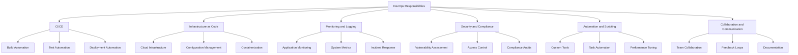

```mermaid

graph TD
    A[DevOps Responsibilities] --> B[CI/CD]
    A --> C[Infrastructure as Code]
    A --> D[Monitoring and Logging]
    A --> E[Security and Compliance]
    A --> F[Automation and Scripting]
    A --> G[Collaboration and Communication]

    B --> B1[Build Automation]
    B --> B2[Test Automation]
    B --> B3[Deployment Automation]

    C --> C1[Cloud Infrastructure]
    C --> C2[Configuration Management]
    C --> C3[Containerization]

    D --> D1[Application Monitoring]
    D --> D2[System Metrics]
    D --> D3[Incident Response]

    E --> E1[Vulnerability Assessment]
    E --> E2[Access Control]
    E --> E3[Compliance Audits]

    F --> F1[Custom Tools]
    F --> F2[Task Automation]
    F --> F3[Performance Tuning]

    G --> G1[Team Collaboration]
    G --> G2[Feedback Loops]
    G --> G3[Documentation]


```
